# Tarea1. Elementos Básicos de Interfaz de Usuario


## Índice

- [Descripción de la aplicación](#descripción-de-la-aplicación)
- [Estructura de la aplicación](#estructura-de-la-aplicación)
- [Categorías de elementos demostrados](#categorías-de-elementos-demostrados)
- [Instrucciones de uso](#instrucciones-de-uso)
- [Instalación](#instalación)


---

# Descripción de la aplicación

Esta aplicación Android demuestra el uso de **Activities y Fragments** para presentar distintos **elementos de interfaz de usuario (UI)** disponibles en Android.

La aplicación cuenta con una **Activity principal** que incluye un **menú de navegación inferior**. Desde este menú el usuario puede acceder a diferentes secciones que muestran una **vista previa mediante Fragments**.

Cada Fragment incluye una breve explicación del tipo de elemento y un botón **"Abrir en nueva Activity"**, donde se presentan **ejemplos interactivos**.

Al interactuar con los elementos, la aplicación muestra un **Toast** indicando qué acción realizó el usuario.

---

# Estructura de la aplicación

La arquitectura implementada es la siguiente:

**Activity principal**
- `MainActivity`
- Contiene el menú de navegación inferior.

**Fragments**
- Home
- TextFields
- Botones
- Elementos de selección
- Listas
- Elementos de información

Cada Fragment funciona como **pantalla de introducción** para su categoría.

**Activities de demostración**

Cada categoría abre una Activity independiente donde se muestran ejemplos funcionales de los componentes.

---

# Categorías de elementos demostrados

| Tipo de elemento | Componentes incluidos | Capturas |
|------------------|----------------------|----------|
| **TextFields** | EditText | Ver sección desplegable |
| **Botones** | Button, ImageButton, FloatingActionButton | Ver sección desplegable |
| **Elementos de selección** | CheckBox, RadioButton, Switch | Ver sección desplegable |
| **Listas** | RecyclerView / ListView | Ver sección desplegable |
| **Elementos de información** | TextView, ImageView, ProgressBar | Ver sección desplegable |

---

# Flujo de la aplicación (Capturas de pantalla)

A continuación se muestra el flujo principal de navegación dentro de la aplicación, desde la pantalla inicial hasta los ejemplos interactivos de cada tipo de elemento de interfaz.

---

## 1. Pantalla de bienvenida (Home)

La aplicación inicia en la **pantalla principal**, donde se presenta una breve introducción sobre el objetivo de la aplicación.  
Desde aquí el usuario puede navegar utilizando el **menú inferior** para acceder a cada categoría de elementos de interfaz.

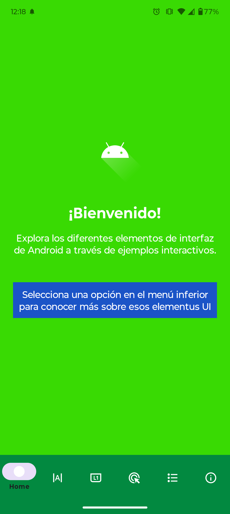

---

# 2. Fragments de previsualización

Cada opción del menú inferior abre un **Fragment de introducción** que explica el tipo de componente de interfaz.

Estos fragments incluyen:

- Título del tipo de elemento
- Explicación breve
- Un botón **"Abrir en nueva Activity"** para ver ejemplos interactivos

---

## TextFields (Fragment de introducción)

Este fragment explica el uso de **campos de entrada de texto** en Android.  
El usuario puede presionar **"Abrir en nueva Activity"** para ver ejemplos funcionales.

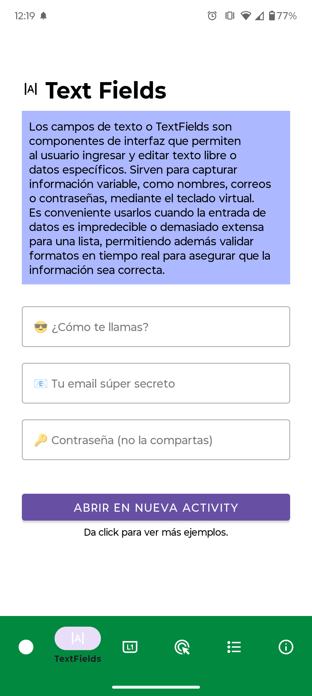

---

## Botones (Fragment de introducción)

En este fragment se explica el uso de **botones para ejecutar acciones dentro de la aplicación**.

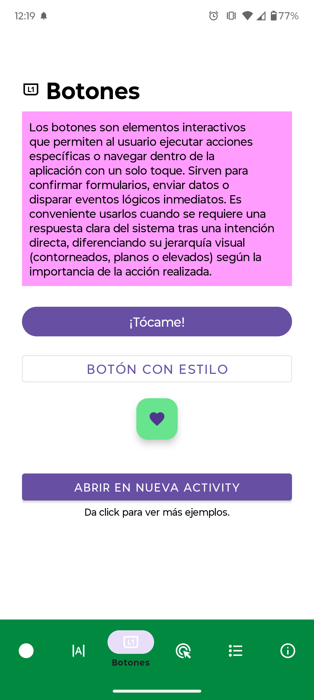

---

## Elementos de selección (Fragment de introducción)

Presenta los componentes que permiten al usuario **seleccionar opciones o estados**.

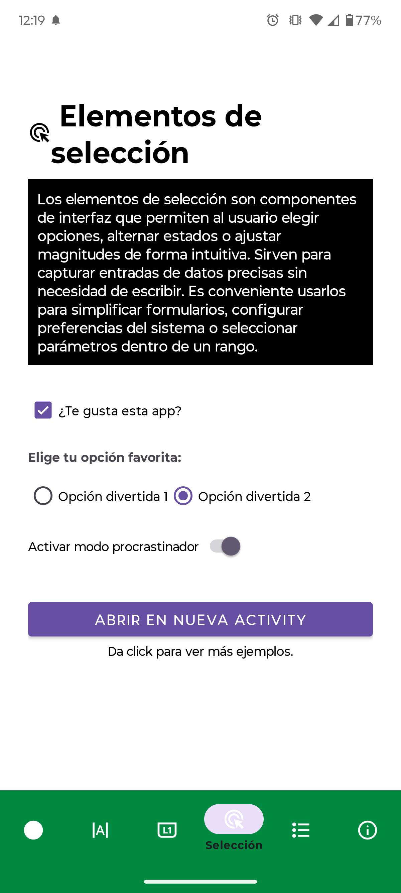

---

## Listas (Fragment de introducción)

Describe los componentes utilizados para mostrar **colecciones de datos** dentro de la interfaz.

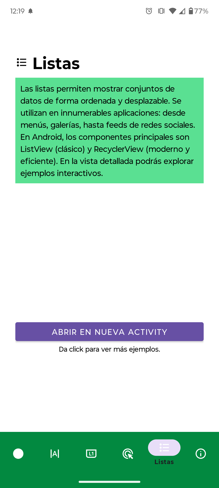

---

## Elementos de información (Fragment de introducción)

Explica los componentes utilizados para **mostrar información al usuario**.

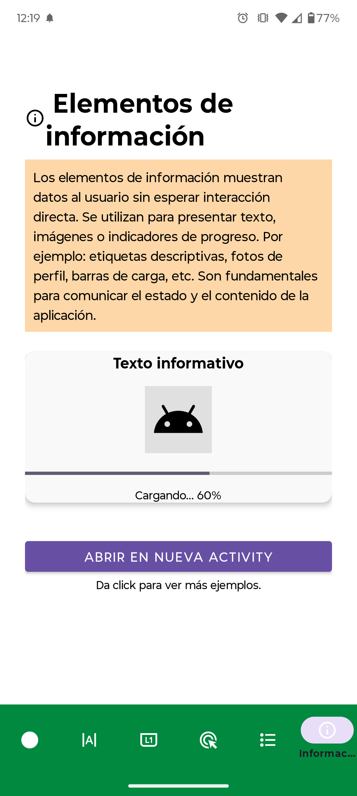

---

# 3. Activities con ejemplos interactivos

Al presionar **"Abrir en nueva Activity"**, la aplicación abre una pantalla donde se muestran **ejemplos funcionales de los componentes**.

Cada elemento puede ser presionado y la aplicación mostrará un **mensaje Toast** indicando la acción realizada.

---

## Activity: TextFields

En esta pantalla se presentan ejemplos de **EditText**, donde el usuario puede interactuar con distintos campos de entrada.

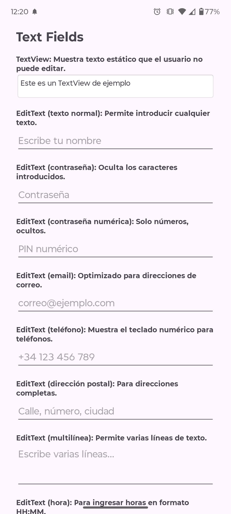

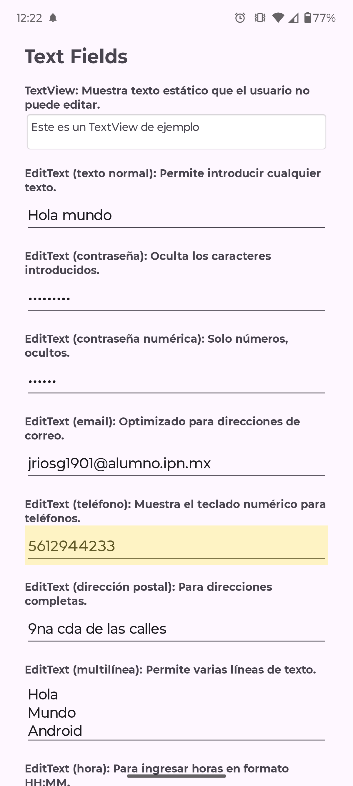

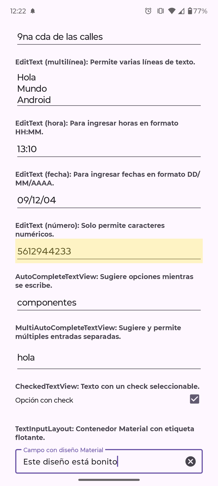

---

## Activity: Botones

Esta pantalla muestra distintos tipos de botones disponibles en Android.

- Button  
- ImageButton  
- FloatingActionButton  

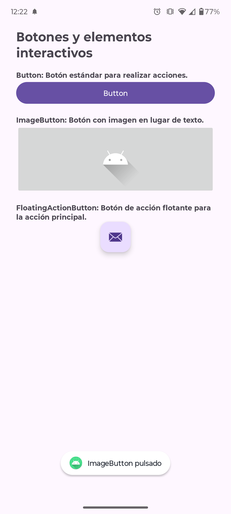

---

## Activity: Elementos de selección

Aquí se muestran componentes utilizados para **seleccionar opciones**.

- CheckBox  
- RadioButton  
- Switch  

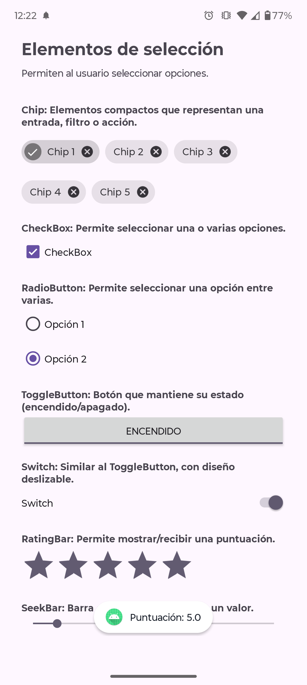

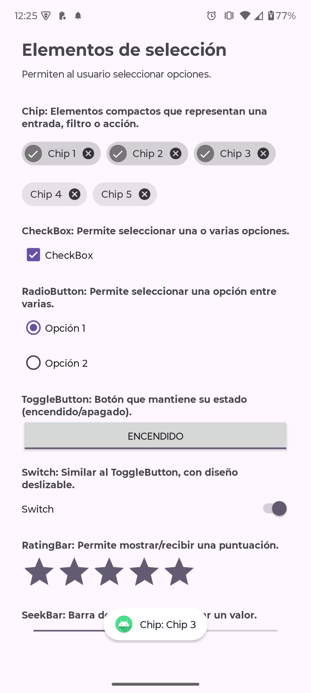

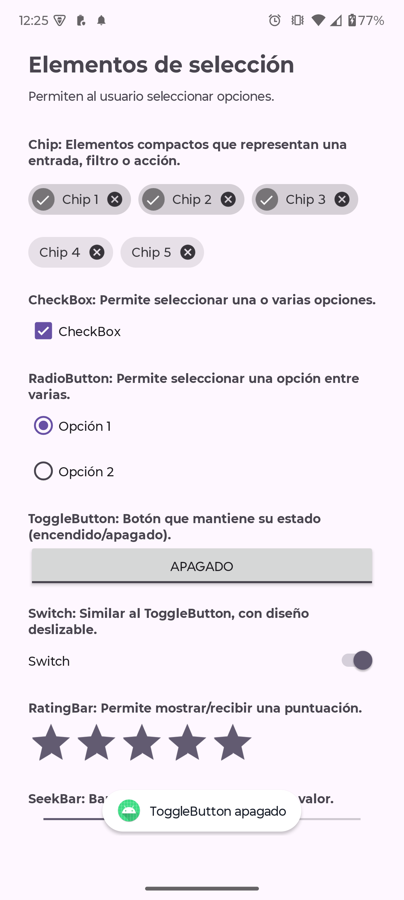

---

## Activity: Listas

En esta sección se muestran ejemplos de componentes para **visualizar colecciones de datos**.

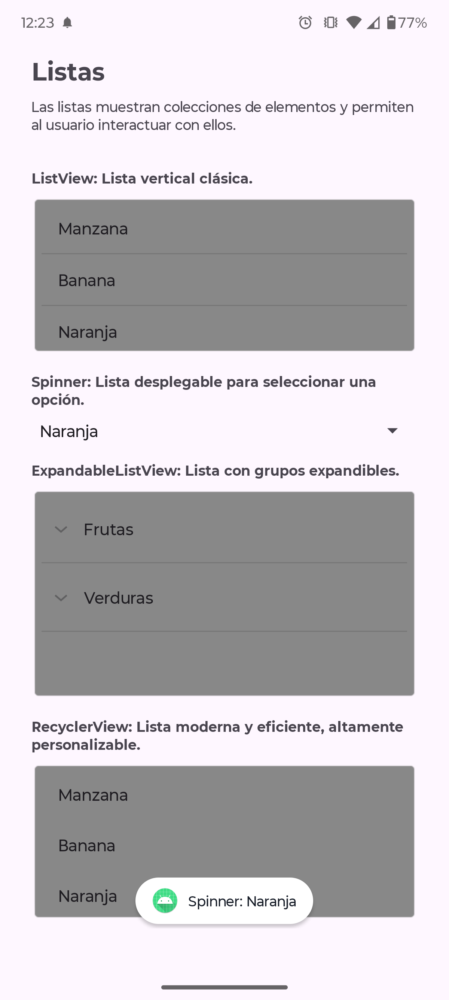

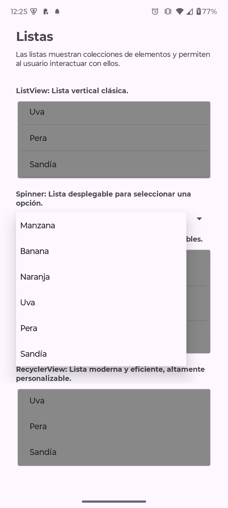

---

## Activity: Elementos de información

Presenta componentes utilizados para **mostrar información visual al usuario**.

- TextView  
- ImageView  
- ProgressBar  

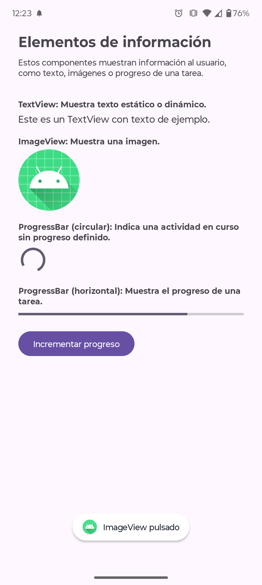

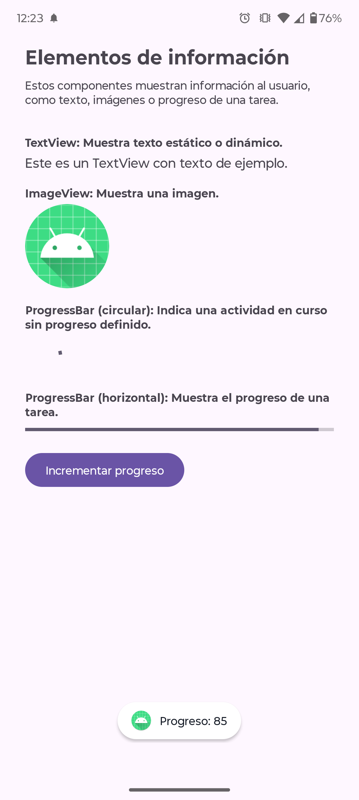

---

# Instrucciones de uso

1. Al iniciar la aplicación se mostrará la **pantalla principal** con el menú inferior.
2. Selecciona alguna de las categorías disponibles:
   - TextFields
   - Botones
   - Elementos de selección
   - Listas
   - Elementos de información
3. Cada sección mostrará un **Fragment con explicación del tipo de elemento**.
4. Presiona el botón **"Abrir en nueva Activity"**.
5. Se abrirá una pantalla con **ejemplos interactivos** de los componentes.
6. Interactúa con los elementos para visualizar los **mensajes Toast** que indican la acción realizada.

---

# Instalación

1. Clonar el respositorio

```bash
git clone https://github.com/stebancito/DAM-T1Activities-Fragments.git
```
2. Abrir Android Studio.
3. Abrir el proyecto de la carpeta en donde se clonó el repositorio.
4. Conectar un dispositivo android o inciar un emulador.
5. Presionar **Run** en Android Studio.
6. Iniciar la aplicación.
